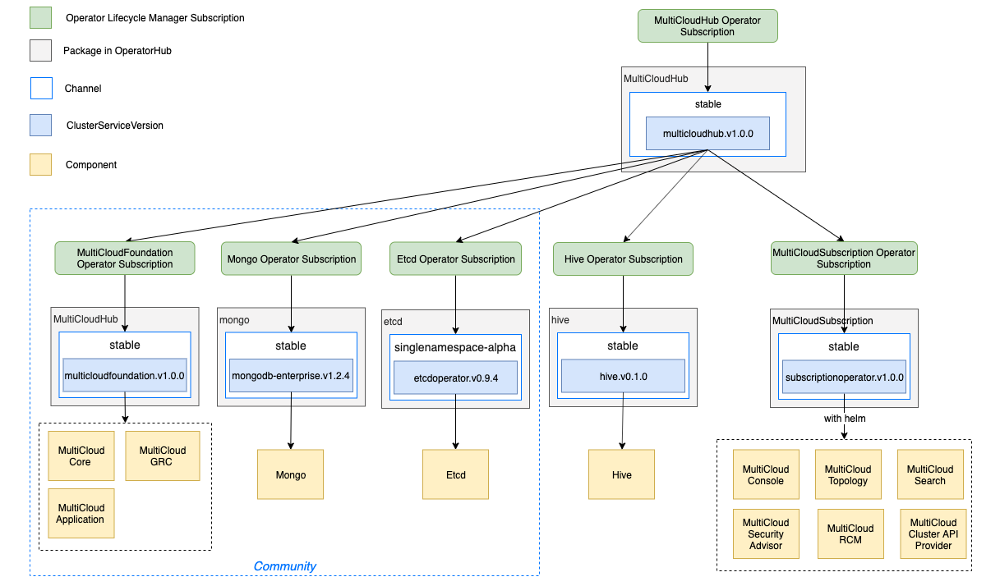
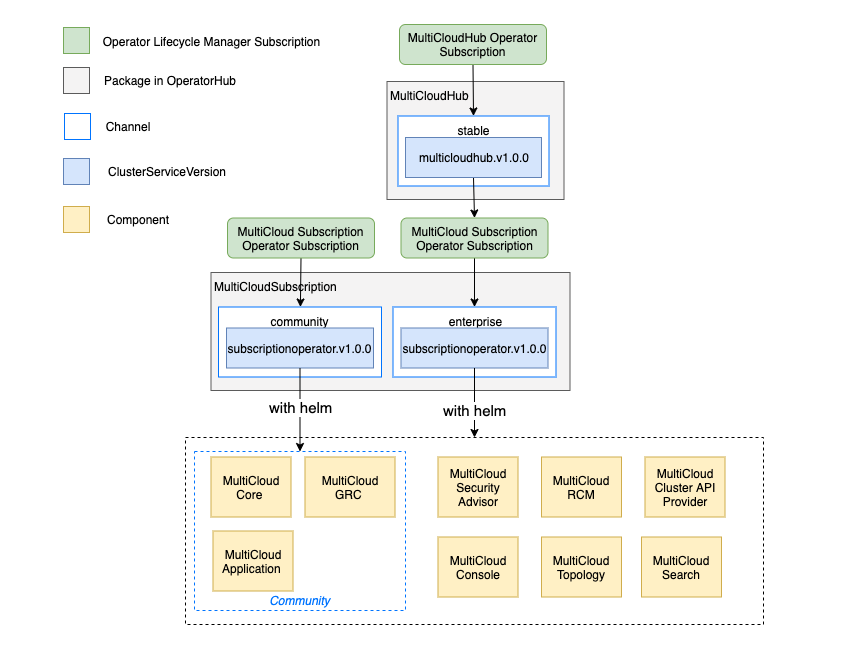

# MulticloudHub Operator

There are two proposals to deploy the multicloud hub with operators in OpenShift

## Proposal #1

For enterprise user, we provide an operator (MultiCloudHub Operator) to deploy all of multicloud hub components, and we also provide an operator (MultiCloud Foundation Operator) to deploy the multicloud hub opensource components (`core`, `application` and `grc`), community user can use this operator to deploy community multicloud hub



### MultiCloudHub Operator

The MultiCloudHub Operator is implemented by using [Operator SDK](https://github.com/operator-framework/operator-sdk/blob/master/doc/user-guide.md), we bundle the CRD and `ClusterServiceVersion` of this operator to a package (see [operator-registry](https://github.com/operator-framework/operator-registry#operator-registry)) and publish it to [OpenShift OperatorHub](https://docs.openshift.com/container-platform/4.2/operators/olm-understanding-operatorhub.html). User can define an OpenShift Operator Lifecycle Manager (OLM) `Subscription` to deploy this operator, e.g.

```yaml
apiVersion: operators.coreos.com/v1alpha1
kind: Subscription
metadata:
  name: multicloudhub-subscription
  namespace: multicloud-system
spec:
  channel: stable
  name: multicloudhub
  source: certified-operators
  sourceNamespace: openshift-marketplace
  startingCSV: multicloudhub.v1.0.0
```

After the operator was installed by OLM, user uses `MultiCloudHub` CRD to define the multicloud hub deployment configuration, its corresponding CR looks like

```yaml
apiVersion: operators.multicloud.ibm.com/v1alpha1
kind: MultiCloudHub
metadata:
  name: myhub
  namespace: mutilcloud-system
spec:
  version: 3.3.0
  dockerRepository: "ibmcom"
  imagePullPolicy: Always
  imagePullSecret: ""
  nodeSelector: |
    os: ""
    customLabelSelector: ""
    customLabelValue: ""
  foundation:
    apiserver:
      replicas: 1
      apiserverSecret: ""
      klusterletSecret: ""
      configuration:
        http2-max-streams-per-connection: 1000
    controller:
      replicas: 1
      configuration:
        enable-rbac: true
        enable-service-registry: true
  console:
    enabled: true
  topology:
    enabled: true
  security_advisor:
    enabled: true
  cluster-api-provider:
    enabled: true
  # cam, cem and hive can be added here
  etcd:
    replicas: 1
    storage:
      type: ephemeral/persistence # default is ephemeral
      storageClass: ""
      capacity: "1Gi"
    externalServers:
      endpoints: null
      secret: null
  mongo:
    replicas: 1
    storage:
      type: ephemeral/persistence # default is ephemeral
      storageClass: ""
      capacity: "10Gi"
    externalServers:
      endpoints: mongodb
      replicaSet: rs0
      userSecret: icp-mongodb-admin
      tlsSecret: cluster-ca-cert
      caSecret: cluster-ca-cert
```

As an easiest way, user use a default CR to deploy the multicloud hub, e.g.

```yaml
apiVersion: operators.multicloud.ibm.com/v1alpha1
kind: MultiCloudHub
metadata:
  name: myhub
  namespace: mutilcloud-system
spec: {}
```

Then the MultiCloudHub operator will deploy the multicloud hub to namespace `mutilcloud-system`, it will follow below steps

- For mongo and etcd, if user does not configure the external servers for them, the operator will deploy their operators with OLM subscriptions, then the operator creates the corresponding CR with the defined configuration to deploy them
- Deploy the multicloud foundation operator, hive operator, and [subscription operator](https://github.ibm.com/IBMPrivateCloud/cp4mcm-manifest/tree/master/base/subscription-operator) with their OLM subscription, then the operator creates the corresponding CR with the defined configuration to deploy them
- For subscription operator, the operator creates helm channel and subscription CR with the defined configuration, the subscription operator deploys the `console`, `topology`, `security_advisor`, `rcm` and `security_advisor` components with the helm channel and subscription CR (If each component has its own operator in OperatorHub, we can replace this step by deploying the component with OLM subscription directly)

After user apply the MultiCloudHub CR, user can query the CR to get the defualt configuration and status

```yaml
apiVersion: operators.multicloud.ibm.com/v1alpha1
kind: MultiCloudHub
metadata:
  name: myhub
  namespace: mutilcloud-system
spec:
  version: 3.3.0
  dockerRepository: "ibmcom"
  imagePullPolicy: Always
  foundation:
    apiserver:
      replicas: 1
      apiserverSecret: "mcm-apiserver-secret"
      klusterletSecret: "mcm-apiserver-klusterlet-secret"
      configuration:
        http2-max-streams-per-connection: 1000
    controller:
      replicas: 1
      configuration:
        enable-rbac: true
        enable-service-registry: true
  console:
    enabled: true
  topology:
    enabled: true
  security_advisor:
    enabled: true
  cluster-api-provider:
    enabled: true
  etcd:
    replicas: 1
    storage:
      type: ephemeral
  mongo:
    replicas: 1
    storage:
      type: ephemeral
status:
  phase: "Running"
  deployments:
  - name: mutilcloud-system/apiserver
    availableReplicas: 1
    conditions:
    - lastTransitionTime: "2019-09-26T02:25:34Z"
        lastUpdateTime: "2019-09-26T02:25:34Z"
        message: Deployment has minimum availability.
        reason: MinimumReplicasAvailable
        status: "True"
        type: Available
    - lastTransitionTime: "2019-09-26T02:23:16Z"
        lastUpdateTime: "2019-09-26T02:25:38Z"
        message: ReplicaSet "mcm-core-apiserver-5cfdc8844d" has successfully progressed.
        reason: NewReplicaSetAvailable
        status: "True"
        type: Progressing
  # ... other components deployment conditions
```

### MultiCloudFoundation Operator

The MultiCloudFoundation Operator is implemented by using [Operator SDK](https://github.com/operator-framework/operator-sdk/blob/master/doc/user-guide.md), with this operator we can rotate the certifacate and manage the secrets in the operator, this operator deploy the multicloud foundation components, includes: mcm `core`, `application` and `grc`, user can use this operator to deploy community multicloud hub, its corresponding CR looks like

```yaml
apiVersion: operators.multicloud.ibm.com/v1alpha1
kind: MultiCloudFoundation
metadata:
  name: myhub
  namespace: mutilcloud-system
spec:
  version: 3.3.0
  imageRepository: "quay.io/rhibmcollab"
  imagePullPolicy: Always
  imagePullSecret: ""
  nodeSelector: |
    os: ""
    customLabelSelector: ""
    customLabelValue: ""
  foundation:
    apiserver:
      replicas: 1
      apiserverSecret: ""
      klusterletSecret: ""
      configuration:
        http2-max-streams-per-connection: 1000
    controller:
      replicas: 1
      configuration:
        enable-rbac: true
        enable-service-registry: true
  etcd:
    endpoints: null
    secret: null
  mongo:
    endpoints: null
    replicaSet: null
    userSecret: null
    tlsSecret: null
    caSecret: null
```

To install a community version multicloud hub, user follow below steps

1. Deploy the `etcd` and `mongo` in OperatorHub

2. Deploy the MultiCloudFoundation operator, e.g.

    ```yaml
    apiVersion: operators.coreos.com/v1alpha1
    kind: Subscription
    metadata:
      name: multicloudhub-subscription
      namespace: multicloud-system
    spec:
      channel: stable
      name: multicloudfoundation
      source: community-operators
      sourceNamespace: openshift-marketplace
      startingCSV: multicloudfoundation.v1.0.0
    ```

3. After the OLM installs the MultiCloudFoundation operator with the `Subscription`, user defines a CR to describe the multicloud hub configuration, e.g.

    ```yaml
    apiVersion: operators.multicloud.ibm.com/v1alpha1
    kind: MultiCloudFoundation
    metadata:
      name: myhub
      namespace: mutilcloud-system
    spec:
      etcd:
        endpoints: etcd-0.etcd:2379,etcd-1.etcd:2379,etcd-2.etcd:2379
      mongo:
        endpoints: mongo-0.mongo
        replicaSet: rs0
    ```

Then the MultiCloudHub operator will deploy the multiCloud hub to namespace `mutilcloud-system`, after user apply the MultiCloudHub CR, user can query it to get the defualt configuration and status

## Proposal #2

For enterprise user, we provide an operator (MultiCloudHub Operator) to deploy all of multicloud hub components, and we also package the [subscription operator](https://github.ibm.com/IBMPrivateCloud/cp4mcm-manifest/tree/master/base/subscription-operator) and publish it to OpenShift OperatorHub, in this operator package (`packagemanifests`), we define two channels, one is `community` and the other is `enterprise`, user can define an OLM `Subscription` to subscribe `community` channel to install community multicloud hub.



For enterprise user, same with the proposal #1, user define the OLM `Subscription` and corresponding CR to deploy all of the multicloud hub components, For community user, user define the OLM `Subscription` for multicloud subscription operator to deploy the multicloud subscription operator, then user prepare `etcd` and `mongo` and define the helm channel and subscription CR to deploy the community multicloud hub (we need opensource the helm chart).
